# jpa_shop_project

### 초기 DataBase 구성

더보기

#### member
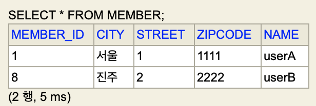

#### item
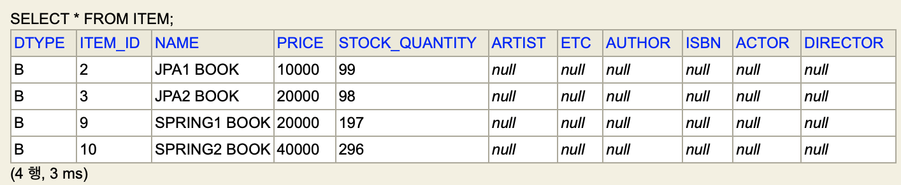

#### delivery
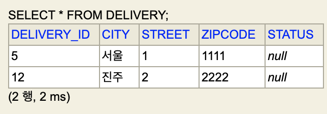

#### orders
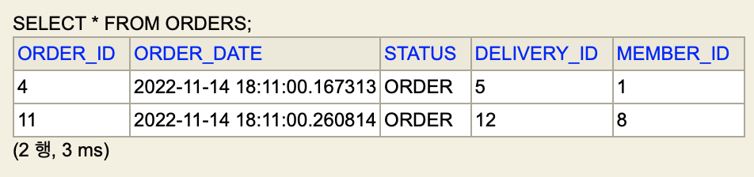

#### orderItem
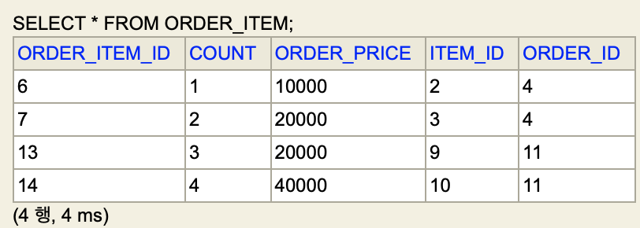

### SWAGGER
* [스웨거 HTML](http://localhost:8080/swagger-ui/index.html)

회원가입 API

#### 회원가입
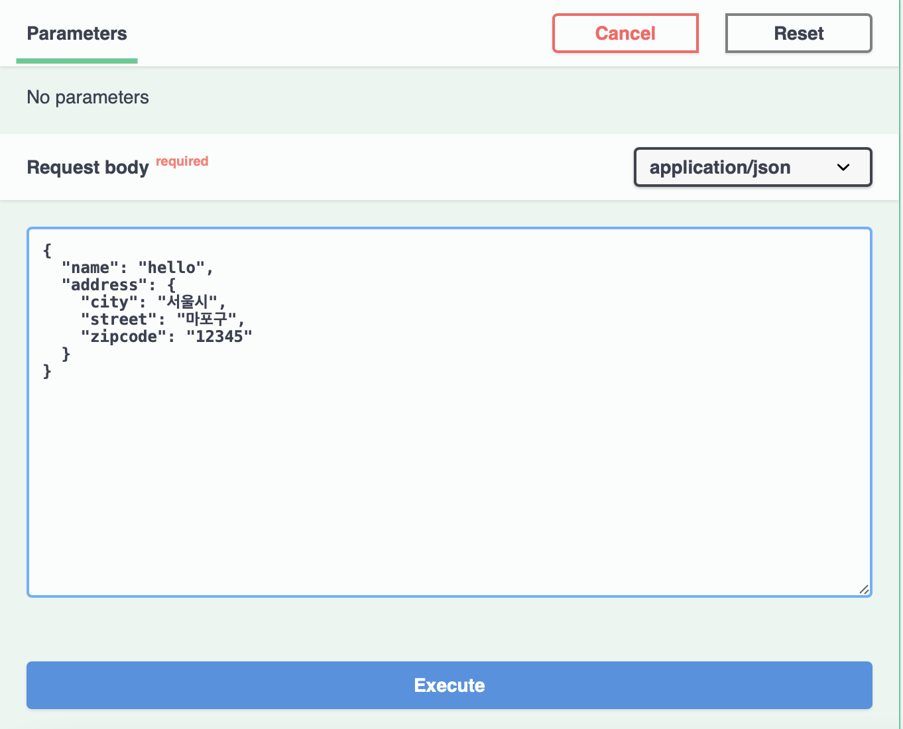

#### 회원가입 응답
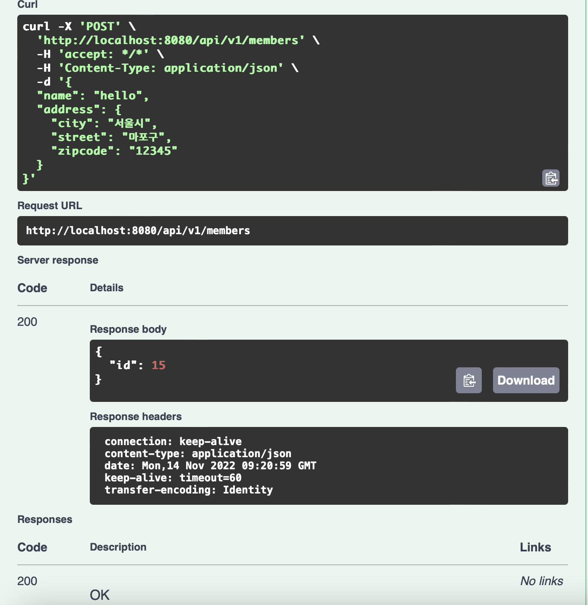

회원 조회 API

#### 회원조회
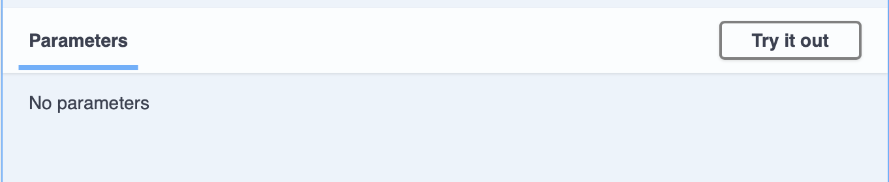

#### 회원조회 응답
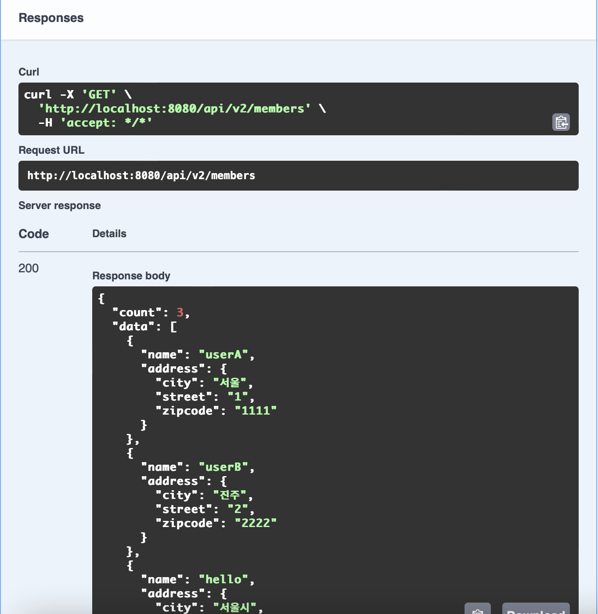

회원 정보 수정 API

#### 회원정보수정
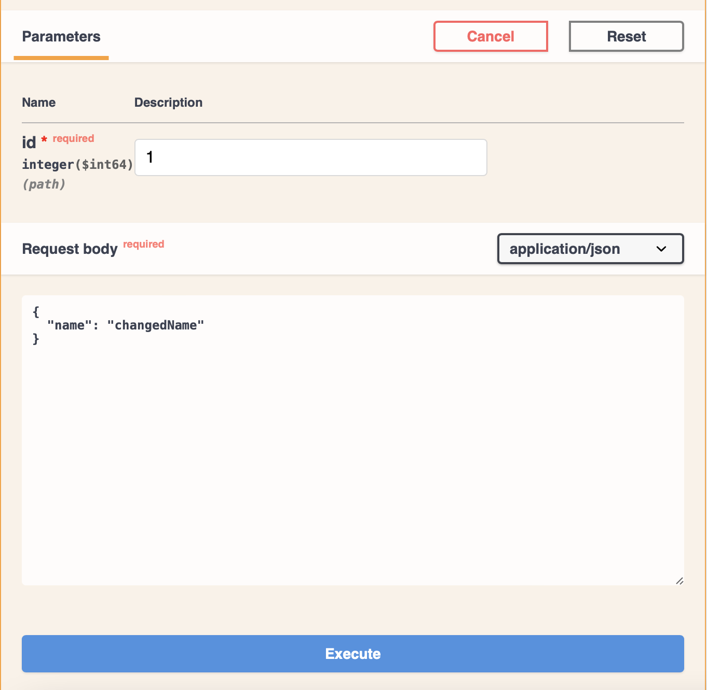

#### 회원정보수정 응답
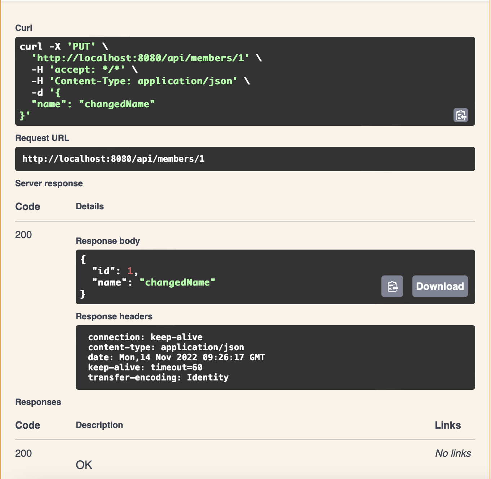

간단한 주문 조회 API

#### 간단한 주문 조회
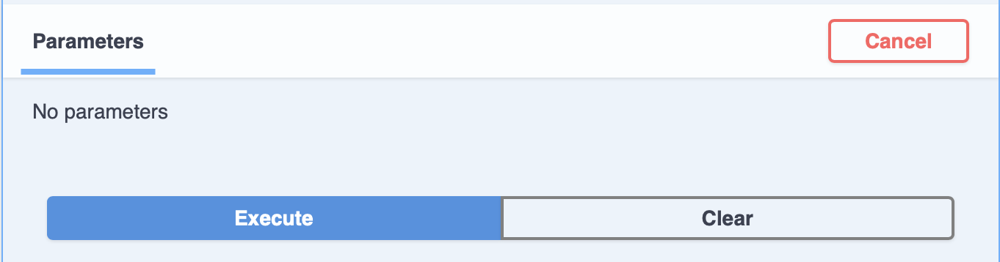

#### 간단한 주문 조회 응답
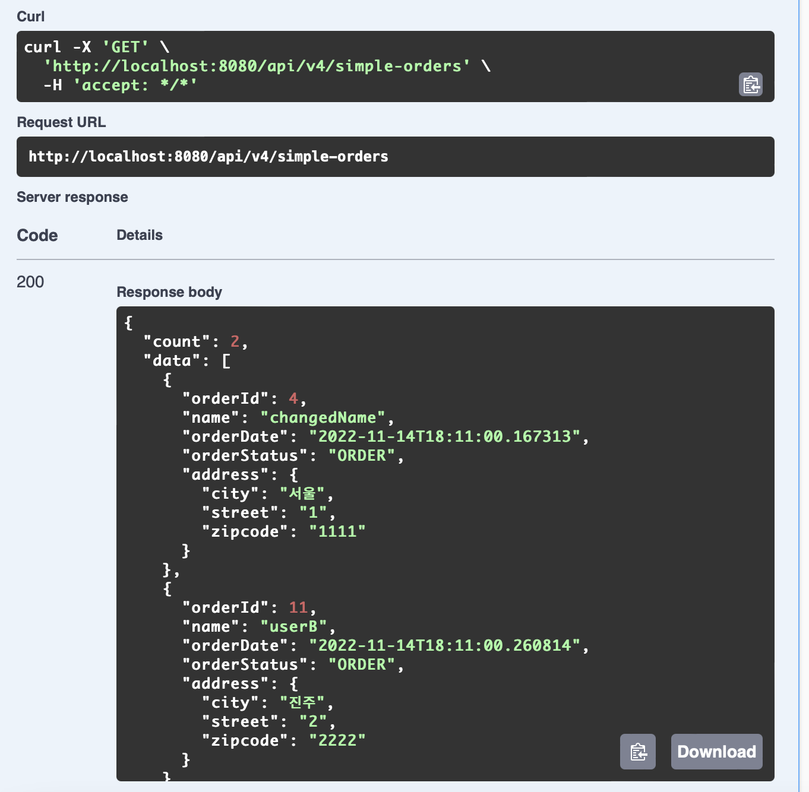

주문 내역 조회 API

#### 주문 내역 조회
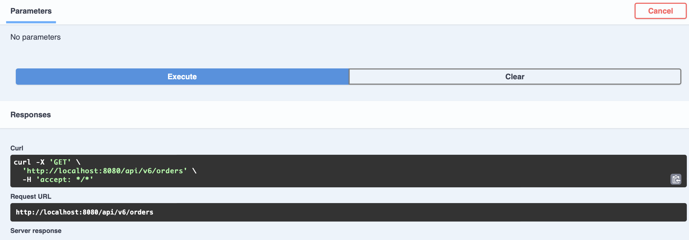

#### 주문 내역 조회 응답
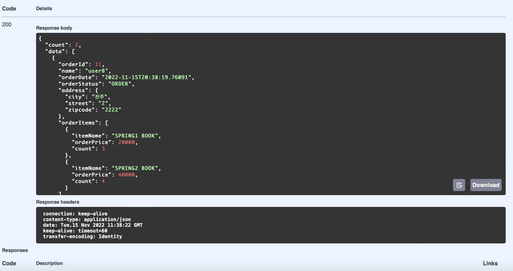

