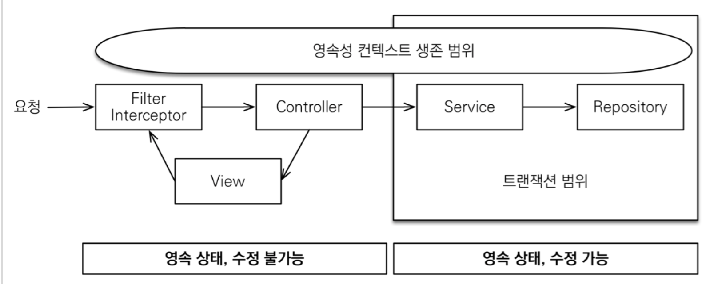
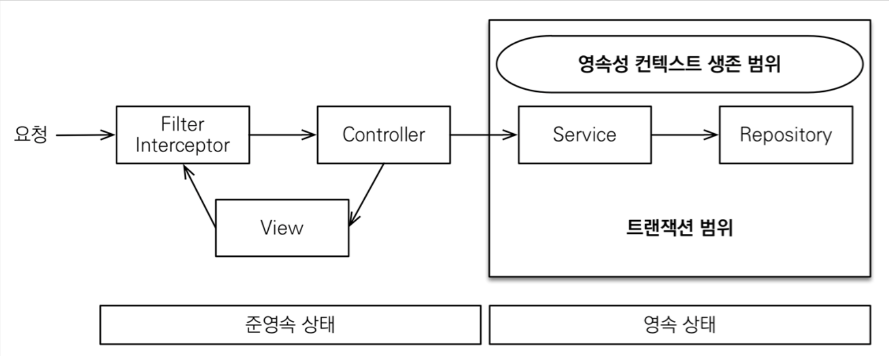
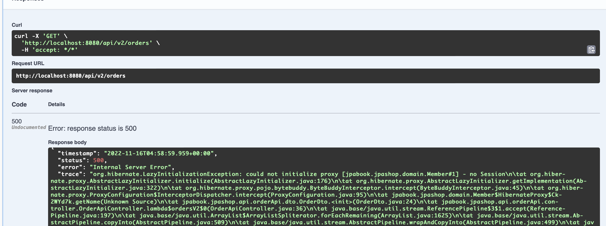

# OSIV와 성능 최적화
- hibernate: Open Session In View
- JPA: Open EntityManager In View

## OSIV ON

- spring.jpa.open-in-view: 기본값 (true)
- 기본값을 뿌리면서 애플리케이션 시작 시점에 warn 로그를 남기는 이유가 존재한다.
- OSIV 전락은 트랜잭션 시작처럼 초기 데이터베이스 커넥션 시점 부터 API 응답이 끝날 때까지 영속성 컨텍스트와 데이터베이스 커넥션을 유지한다.

### 장점
- 커넥션을 유지하기 때문에 View Template나 ApiController에서 지연로딩이 가능했던 것이다.
### 단점
- 너무 오랜시간동안 데이터베이스 커넥션 리소스를 사용하기 때문에, 실시간 트래픽이 중요한 애플리케이션에서는 커넥션이 모자를 수 있다.

## OSIV OFF

- spring.jpa.open-in-view: false

### 장점
- 커넥션을 빠르게 반환받을 수 있다.
- 트랜잭션을 종료할 때 영속성 컨텍스트를 닫고, 데이터베이스 커넥션도 반환한다. 따라서 커넥션 리소스를 낭비하지 않는다.

### 단점
- 모든 지연로딩을 트랜잭션 안에서 처리해야 한다. 따라서 지금까지 작성한 많은 지연 로딩 코드를 트랜잭션 안으로 넣어야 하는 단점이 있다. 
- 그리고 view template에서 지연로딩이 동작하지 않는다. 결론적으로 트랜잭션이 끝나기 전에 지연 로딩을 강제로 호출해 두어야 한다.

### 예제
- application.yml 파일에 `open-in-view: false` 추가

- could not initialize proxy라는 에러를 발생시킨다. (영속성 컨텍스트를 통해 프록시를 초기화해야하는데 하지 못함)
- 컨트롤러에 영속성 컨텍스트가 없기때문이다.

### 해결방법
- 커멘드와 쿼리를 분리한다: 실무에서는 OSIV를 끈 상태로 복잡성을 관리하는 것이 좋다.